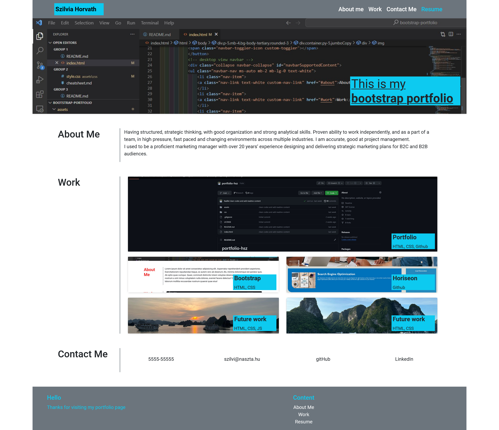

# bootstrap-portfolio (front-end only)

# Table of content

[Overview](#Overview)
[Screenshots](#Screenshots)
[Links](#Links)
[My_process](#My_process)
[Built_with](#Built_with)
[What_I_learned](#What_I_learned)
[Continued_developement](#Continued_developement)
[Author](#Author)
[Sources](#Sources)

# Overview
This is the solution of the 3rd week challange, bootstrap-portfolio. In this challange I had to recreate the portfolio website from scratch using Bootstrap. 

## Screenshots

bootstrap-portfolio screenshot 
[screenshot mobileview](./assets/images/mobile-view.png)

### Links
bootstrap-portfolio on github[https://github.com/hszilvi/bootstrap-portfolio]
live link[https://hszilvi.github.io/bootstrap-portfolio/]

## My_process
I recreated the layout was given using Bootstrap. I used Bootstrap's in-built styles.

I used HTML, Bootstrap and a little CSS to make the website work and meet all the layout criterias. I learned how to use Bootstrap docs to recreate the portfolio website. 

I wrote the readme.md with the relative path to screen shot and links and other expected contents. 

### Built_with
HTML, Bootstrap, CSS, VS code

## What_I_learned
I learned a lot about Bootstrap. I have a good understanding in using the Bootstrap grid system and components. 

### Continued_developement
- I still need to learn more about Bootstrap.
- need to practise more CSS.

## Author
Szilvia Horvath
GitHub[https://github.com/hszilvi]
LinkedIn[https://www.linkedin.com/in/horvathszilvi/]

# Sources
https://www.youtube.com/watch?v=DFUT5s5SasA
https://www.copycat.dev/blog/bootstrap-breakpoints/
