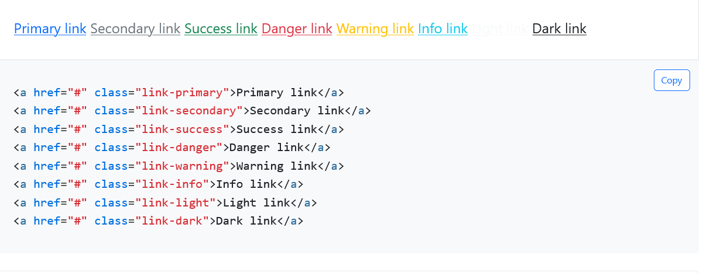

<a href="#" class="link-primary">Primary link</a>
<a href="#" class="link-secondary">Secondary link</a>
<a href="#" class="link-success">Success link</a>
<a href="#" class="link-danger">Danger link</a>
<a href="#" class="link-warning">Warning link</a>
<a href="#" class="link-info">Info link</a>
<a href="#" class="link-light">Light link</a>
<a href="#" class="link-dark">Dark link</a>

<!-- formatting navbar -->
<!-- fixed top -->
<nav class="navbar fixed-top navbar-light bg-light">
  <a class="navbar-brand" href="#">Fixed top</a>
</nav>

<!-- fonts -->
https://getbootstrap.com/docs/5.2/utilities/text/

bg-body-tertiary rounded-3